# Echoo

A full-stack social platform: posts, reactions, mentions, comments, friends and
notifications. React 19 + TypeScript on the front, Express 5 + MongoDB on the back.

<!-- Replace with your live URLs once deployed -->
Live demo: not deployed yet · API: not deployed yet

## Screenshots

| Feed — light | Feed — dark |
| --- | --- |
| 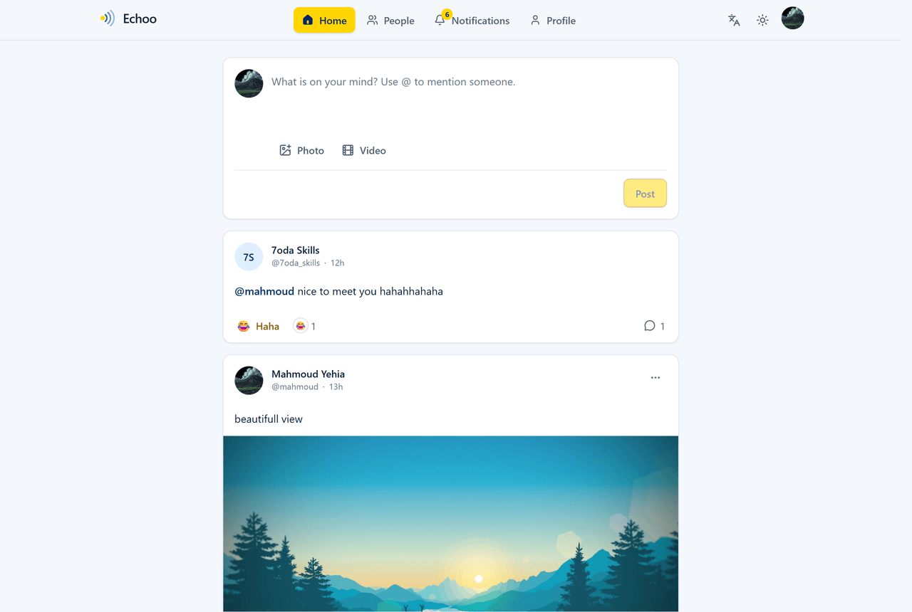 | 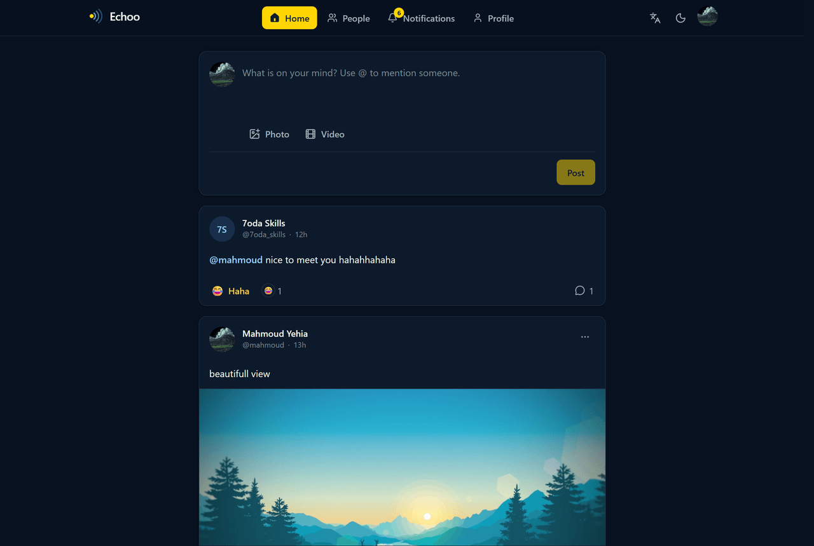 |

| Post detail | Who reacted |
| --- | --- |
| 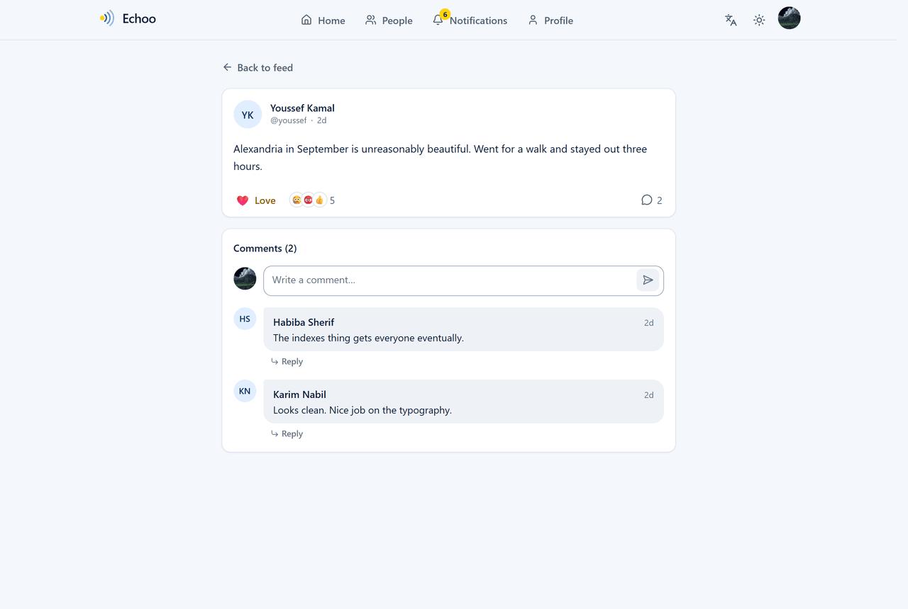 | 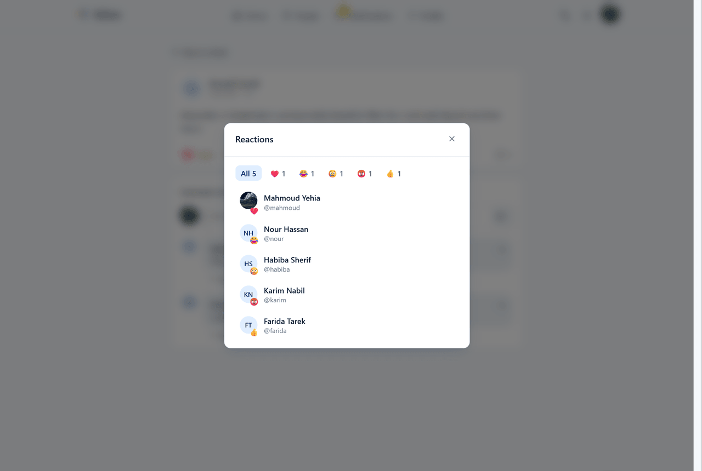 |

| Notifications, with push | People |
| --- | --- |
| 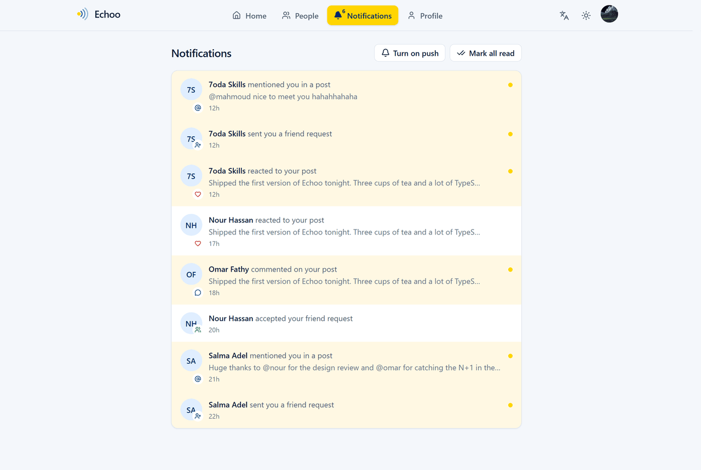 | 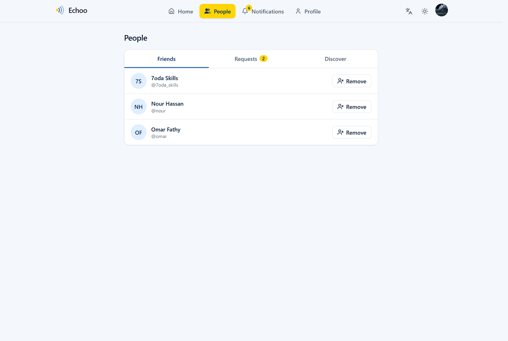 |

| Profile | Arabic, right to left |
| --- | --- |
| 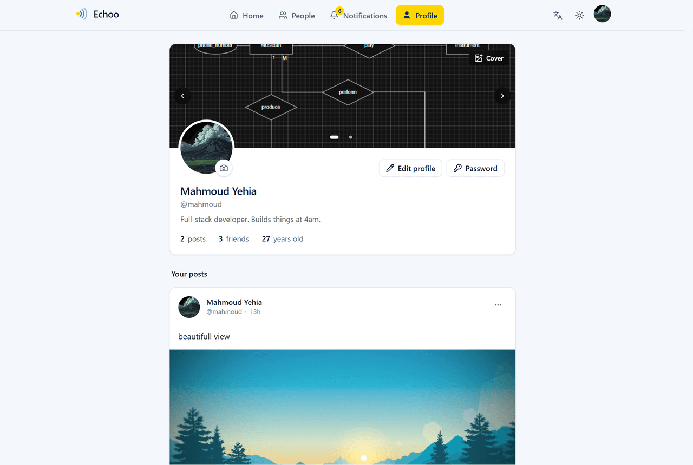 | 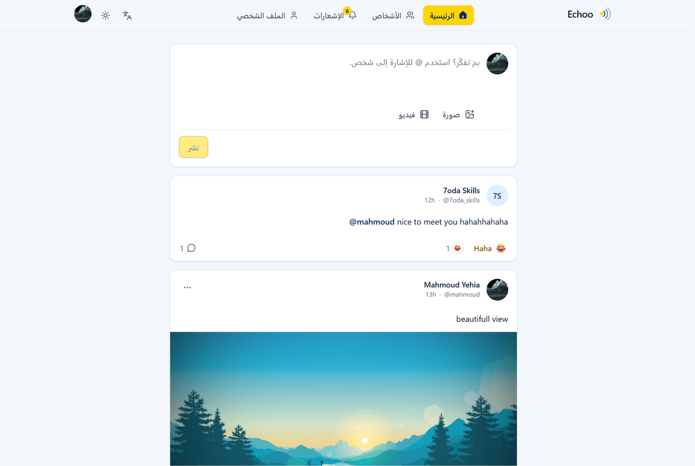 |

| Sign in | Sign up |
| --- | --- |
|  | 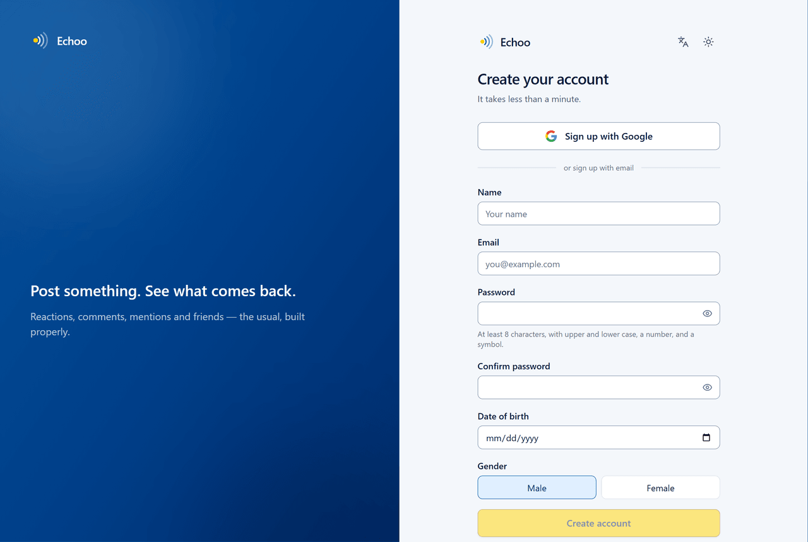 |

| Sign in — dark | Mobile |
| --- | --- |
| 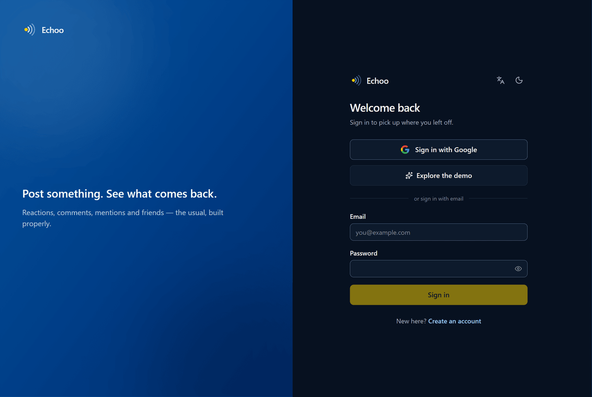 | 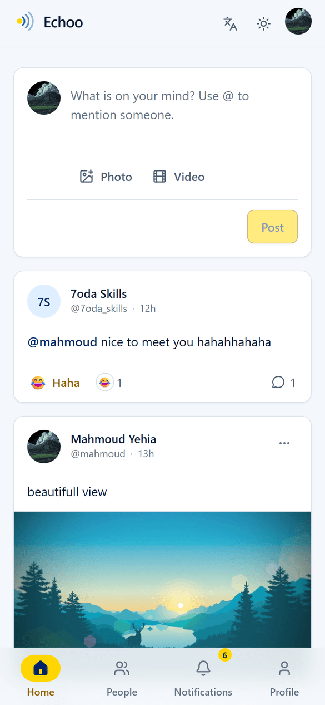 |

## Features

**Accounts**
- Sign-up confirmed by a six-digit code emailed to the address
- Passwords hashed with bcrypt (cost 12) — never stored or returned in plaintext
- Short-lived JWT access tokens with silent, automatic refresh
- Change password, which signs you out of every other device
- Password fields have a reveal toggle; submit stays disabled until valid

**Social**
- Feed with infinite scroll and skeleton loading states
- Compose posts with text, an image, or a video (50 MB cap)
- Six reactions per post, one per person, applied optimistically
- See exactly who reacted, filterable by reaction type
- @mentions with typeahead autocomplete, rendered as links to profiles
- Comment threads with inline editing
- Edit and delete your own posts and comments; ownership is enforced server-side
- Profiles with avatar, cover photo, bio, an editable @handle, age and post history

**People**
- Friend requests: send, accept, decline, and remove
- Friends list, pending requests in both directions, and a discovery list
- Friend counts kept on the user record rather than counted on every request

**Notifications**
- Reactions, comments, mentions, and friend activity in one feed
- Unread badge in the header, polled on an interval
- Mark one or all as read
- Browser push through Firebase Cloud Messaging, opt-in per device, so
  notifications arrive with the tab closed

**Interface**
- Light, dark, and system themes
- English and Arabic, with a full right-to-left layout
- Responsive: desktop navigation collapses to a mobile bottom bar
- Keyboard-navigable throughout, with focus-trapped dialogs and a skip link
- Every action has a loading, empty, and error state

## Tech stack

| | |
| --- | --- |
| **Client** | React 19, TypeScript, Vite 7, Tailwind CSS 4, TanStack Query 5, React Hook Form, Zod, React Router 7 |
| **Server** | Node 22, Express 5, TypeScript, MongoDB with Mongoose 9, JWT, bcrypt, Zod, Multer, Nodemailer |
| **Messaging** | Firebase Cloud Messaging (web push), Google Identity Services (sign-in) |
| **Infra** | npm workspaces, Cloudinary, Docker, Vercel (web), Render (API), MongoDB Atlas |

## Architecture

```
echoo/
├─ apps/
│  ├─ api/                     Express 5 REST API
│  │  └─ src/
│  │     ├─ common/            Shared kernel
│  │     │  ├─ exceptions/     Typed error hierarchy with stable codes
│  │     │  ├─ security/       Password hashing, JWT signing and verification
│  │     │  ├─ mentions.ts     Resolves @handles to user ids at write time
│  │     │  ├─ otp.ts          Six-digit codes: generate, hash, compare
│  │     │  ├─ mail/           Nodemailer transport and message templates
│  │     │  ├─ push/           Firebase Cloud Messaging delivery
│  │     │  ├─ storage/        Cloudinary image uploads
│  │     │  ├─ validation/     Reusable Zod field rules
│  │     │  └─ response/       The single success envelope
│  │     ├─ config/            Environment parsed and validated at boot
│  │     ├─ DB/
│  │     │  ├─ models/         User, Post, Comment, Reaction,
│  │     │  │                  Notification, Friendship
│  │     │  └─ repository/     Generic typed data-access layer
│  │     ├─ middleware/        auth, validation, upload, error handling
│  │     └─ modules/           auth · posts · comments · users
│  │                           reactions · notifications · friends
│  │        └─ <module>/       controller → service → validation → mapper
│  └─ web/                     React client
│     ├─ public/
│     │  └─ firebase-messaging-sw.js  Background push service worker
│     └─ src/
│        ├─ components/ui/     Design-system primitives
│        ├─ components/layout/ App shell, navigation, theme toggle
│        ├─ features/          auth · feed · posts · comments · profile
│        │                     reactions · notifications · friends
│        │  └─ <feature>/      hooks.ts plus components/
│        ├─ i18n/              English and Arabic, with RTL handling
│        ├─ lib/api/           One axios client, one module per resource
│        ├─ providers/         Auth, theme, query client
│        └─ routes/            Lazy routes with auth guards
├─ render.yaml                 API deployment blueprint
└─ vercel.json                 Web deployment, built from the repo root
```

### Decisions worth explaining

**The access token never touches storage.** It lives in a module-scoped
variable, so an XSS bug cannot read it. The refresh token is an `httpOnly`,
`Secure`, `SameSite=None` cookie that JavaScript cannot see at all. On page
load the client calls `/auth/refresh` once to mint a new access token, and a
single interceptor renews expired tokens mid-flight.

**Concurrent 401s trigger exactly one refresh.** The response interceptor holds
a shared in-flight promise, so ten simultaneous requests that all expire
together queue on one refresh and then retry, instead of stampeding the
endpoint. See `apps/web/src/lib/api/client.ts`.

**Password changes revoke every existing session.** Changing a password stamps
`credentialsChangedAt` on the user. The auth middleware rejects any token
issued before that instant, which gives "sign out everywhere" without a
server-side session store.

**Query keys are parameterized through a factory.** `apps/web/src/lib/queryKeys.ts`
is the single source of cache keys, so a post detail is keyed by its id and two
profiles can never share a cached list. Mutations invalidate the `posts` prefix,
which covers the feed, detail views, and profile lists at once.

**Errors are typed, and stack traces stay on the server.** Every deliberate
failure extends `ApplicationException` with an HTTP status and a stable
machine-readable `code`. The error handler maps Mongoose cast, duplicate-key,
and validation errors onto the same envelope, and only ever logs stack traces.

**Deletes are soft.** Posts and comments get a `deletedAt` stamp and are
filtered out of every read path, so content can be restored and nothing is
silently lost.

**Verification codes are hashed, expiring and rate-limited.** A six-digit code
is only a million values, so a slow hash buys nothing an attacker could not
brute-force offline; the real protections are a ten-minute expiry, a five-guess
counter that burns the code, and a rate limiter on the endpoint. An unverified
signup can be re-claimed with the same address, so a typo does not permanently
burn it, and the resend endpoint answers identically for unknown addresses so
it cannot enumerate accounts.

**The reaction picker closes on a delay.** It floats above the button with a
gap between them, and closing on `mouseleave` immediately made every reaction
except Like unreachable — the pointer left the target while crossing the gap.
A short close delay plus a padded bridge element fixes it.

**Reactions are optimistic, and the counters are denormalized.** Clicking a
reaction updates the cache immediately using the same rules the server
applies, and rolls back if the request fails. Server-side, tallies live on the
post as a `Map` updated with `$inc`, so rendering a feed never aggregates the
reactions collection — and a page of posts costs exactly one extra query to
find the viewer's own reactions, not one per row.

**Mentions are stored as ids, not text.** Handles are resolved when a post is
written, so renaming an account does not silently break every mention of it.
Rendering splits the text into React nodes rather than injecting HTML, so a
post body can never introduce markup.

**Clicking a post card does not use an overlay link.** A link stretched over
the card would sit on top of the body and make the text impossible to select.
The card handles the click itself and bows out when the click landed on
something interactive or when text was being selected; the comment count is a
real link, so keyboard users still have a focusable way in.

**Rate limiting counts failures, not successes.** Brute force is a stream of
failed attempts, so successful sign-ins do not consume the budget — otherwise
several people behind one IP could lock each other out of a shared demo.

## Getting started

**Requirements:** Node 20+, and MongoDB (local or an Atlas connection string).

```bash
git clone https://github.com/<you>/echoo.git
cd echoo
npm install
```

Create `apps/api/.env`:

```ini
NODE_ENV=development
PORT=3000
DB_URI=mongodb://127.0.0.1:27017/echoo

# Generate each with:
#   node -e "console.log(require('crypto').randomBytes(48).toString('hex'))"
ACCESS_TOKEN_SECRET=
REFRESH_TOKEN_SECRET=

ORIGINS=http://localhost:5173

# Optional. Each block is independently skippable — see the notes below.
GOOGLE_CLIENT_ID=
CLOUDINARY_CLOUD_NAME=
CLOUDINARY_API_KEY=
CLOUDINARY_API_SECRET=
SMTP_HOST=smtp.gmail.com
SMTP_PORT=587
SMTP_USER=
SMTP_PASSWORD=
MAIL_FROM=Echoo <you@gmail.com>
FIREBASE_PROJECT_ID=
FIREBASE_CLIENT_EMAIL=
FIREBASE_PRIVATE_KEY=

DEMO_EMAIL=demo@echoo.app
DEMO_PASSWORD=Demo@1234
```

And `apps/web/.env`:

```ini
# No trailing slash, and no /api/v1 suffix. Must match the port the API binds,
# or the browser reports "Can't reach Echoo right now" — which looks like a
# network fault rather than the config one it is.
VITE_API_BASE_URL=http://localhost:3000

# Powers the "Explore the demo" button. Leave blank to hide it.
VITE_DEMO_EMAIL=demo@echoo.app
VITE_DEMO_PASSWORD=Demo@1234

# Public by design — it ships in the bundle. Must be the SAME value as
# GOOGLE_CLIENT_ID above. Leave blank to hide the Google button.
VITE_GOOGLE_CLIENT_ID=

# Firebase, for browser push. Firebase console → Project settings → General
# for the first six, and → Cloud Messaging → Web Push certificates for the
# key pair. All seven or none: a partial set hides the push toggle and never
# loads the SDK.
VITE_FIREBASE_API_KEY=
VITE_FIREBASE_AUTH_DOMAIN=
VITE_FIREBASE_PROJECT_ID=
VITE_FIREBASE_STORAGE_BUCKET=
VITE_FIREBASE_MESSAGING_SENDER_ID=
VITE_FIREBASE_APP_ID=
VITE_FIREBASE_VAPID_KEY=
```

Every variable is validated by Zod at boot (`apps/api/src/config/config.ts`),
so a missing secret fails immediately and by name rather than surfacing later
as a JWT signed with `undefined`.

Seed a sample feed, then start both apps:

```bash
npm run seed -w @echoo/api
npm run dev
```

The client runs on <http://localhost:5173> and the API on <http://localhost:3000>.

> Image uploads need Cloudinary credentials in `apps/api/.env`. Without them
> everything else works, and upload attempts return a clear 503.

### Email delivery

Signup verification codes go out through nodemailer. Leave `SMTP_USER` and
`SMTP_PASSWORD` blank and the API prints each code to its own log, which is
enough to finish a signup locally without a mail server.

To send for real over Gmail:

1. Turn on 2-Step Verification, then create an App Password at
   <https://myaccount.google.com/apppasswords>.
2. Put the 16 characters in `SMTP_PASSWORD` — **no spaces, no quotes** — and
   your Gmail address in `SMTP_USER`.
3. Set `MAIL_FROM` to that same address. Gmail rewrites the From header to the
   authenticated mailbox, so any other domain is silently replaced.

The API verifies the transport at boot and reports the result in its startup
log, so a wrong password shows up immediately rather than as a signup that
appears to succeed and never delivers. `GET /health` reports `mail: true` once
it is working.

### Push notifications

Browser push runs on Firebase Cloud Messaging, and both halves are
configured.

**The web app** reads the seven `VITE_FIREBASE_*` variables above. They are
public at runtime — Vite compiles them into the bundle, and anyone can read
them in devtools — so keeping them in the environment is about the repository
rather than the browser: no project-specific value is committed, and the same
source builds against a different Firebase project by changing the hosting
config alone.

`public/firebase-messaging-sw.js` is a service worker, so it can read neither
the bundle nor the build environment. The app hands it the four keys Cloud
Messaging needs on its registration URL instead. That URL is stable across
loads, so the browser does not re-register on every visit.

Worth doing once the site is live: restrict the browser API key to your own
domains in Google Cloud Console → Credentials → HTTP referrers. That is the
control that actually matters for a key which is visible by design.

**Sending** is authenticated, so the API needs a service account:

1. Firebase console → **Project settings → Service accounts → Generate new
   private key**. That downloads a JSON file.
2. Copy three fields out of it into `apps/api/.env`:
   `project_id` → `FIREBASE_PROJECT_ID`, `client_email` →
   `FIREBASE_CLIENT_EMAIL`, and `private_key` → `FIREBASE_PRIVATE_KEY`.
3. The private key spans multiple lines. Keep it on one line wrapped in double
   quotes with the newlines written as `\n` — the API converts them back. A
   raw multi-line paste is rejected by the PEM parser.

Leave all three blank and everything else still works: the API logs
`Firebase push (in-app notifications only)` at boot and the polled in-app feed
carries on as before. `GET /health` reports `push: true` once it is wired up.

Each browser opts in separately, from the button on the notifications page.
Permission is only ever requested from that click, never on page load, because
a browser that denies once will not prompt again.

### Google sign-in

`GOOGLE_CLIENT_ID` (API) and `VITE_GOOGLE_CLIENT_ID` (web) must be the **same**
client id: the browser mints the ID token against one and the API checks the
token's audience against the other. Two different ids — even within the same
Google Cloud project — fail with *"Could not verify that Google account"*. The
client also needs `http://localhost:5173` listed under **Authorized JavaScript
origins**, or the button never renders at all.

## Scripts

| Command | Description |
| --- | --- |
| `npm run dev` | Run the API and the web app together |
| `npm run build` | Type-check and build both apps |
| `npm run typecheck` | Type-check both apps |
| `npm run lint` | Lint both apps |
| `npm run seed -w @echoo/api` | Reset and seed the database |

## API

Base URL: `/api/v1`. All responses use one envelope:

```jsonc
// success
{ "status": 200, "message": "Done", "data": {}, "meta": {} }

// failure
{
  "status": 400,
  "error": {
    "message": "Validation failed",
    "code": "BAD_REQUEST",
    "details": [{ "field": "email", "message": "Enter a valid email address" }]
  }
}
```

`details` is shaped so the client can map server errors straight onto form fields.

| Method | Endpoint | Auth | Description |
| --- | --- | :---: | --- |
| `POST` | `/auth/signup` | | Create an account and email a code |
| `POST` | `/auth/verify` | | Exchange the code for a session |
| `POST` | `/auth/resend-code` | | Email a fresh code |
| `POST` | `/auth/login` | | Sign in |
| `POST` | `/auth/refresh` | cookie | Mint a new access token |
| `POST` | `/auth/logout` | | Clear the refresh cookie |
| `GET` | `/auth/me` | yes | Current user |
| `PATCH` | `/auth/password` | yes | Change password, revoking other sessions |
| `GET` | `/posts` | yes | Paginated feed |
| `POST` | `/posts` | yes | Create a post (multipart) |
| `GET` | `/posts/:id` | yes | A post with its comments |
| `PATCH` | `/posts/:id` | yes | Update your post |
| `DELETE` | `/posts/:id` | yes | Soft-delete your post |
| `GET` | `/users/:userId/posts` | yes | A user's posts |
| `POST` | `/comments` | yes | Add a comment |
| `PATCH` | `/comments/:id` | yes | Update your comment |
| `DELETE` | `/comments/:id` | yes | Soft-delete your comment |
| `GET` | `/posts/mentions` | yes | Posts you were mentioned in |
| `PUT` | `/reactions/:postId` | yes | Set, switch, or clear your reaction |
| `GET` | `/reactions/:postId` | yes | Who reacted to a post |
| `GET` | `/notifications` | yes | Your notification feed |
| `GET` | `/notifications/unread-count` | yes | Badge count |
| `PATCH` | `/notifications/read-all` | yes | Mark everything read |
| `PATCH` | `/notifications/:id/read` | yes | Mark one read |
| `POST` | `/notifications/push/subscribe` | yes | Register this browser for push |
| `DELETE` | `/notifications/push/subscribe` | yes | Stop pushing to this browser |
| `GET` | `/friends` | yes | Your friends |
| `GET` | `/friends/requests/incoming` | yes | Requests waiting on you |
| `GET` | `/friends/requests/outgoing` | yes | Requests you sent |
| `GET` | `/friends/suggestions` | yes | People you are not connected to |
| `POST` | `/friends/requests/:userId` | yes | Send a friend request |
| `PATCH` | `/friends/requests/:id` | yes | Accept or decline a request |
| `DELETE` | `/friends/:userId` | yes | Remove a friend |
| `GET` | `/users/search` | yes | Handle typeahead for mentions |
| `PATCH` | `/users/me` | yes | Update name, handle, or bio |
| `GET` | `/users/by-username/:username` | yes | A public profile plus friend state |
| `PUT` | `/users/me/photo` | yes | Upload an avatar |
| `PUT` | `/users/me/cover` | yes | Upload a cover photo |
| `GET` | `/health` | | Liveness probe |

## Security

- **Passwords** — bcrypt at cost 12; the hash is `select: false` so it cannot be
  returned by an endpoint that forgets to strip it
- **Email verification** — signup issues a hashed, ten-minute, five-attempt code;
  sign-in on an unconfirmed account is refused with a distinct error code
- **Rate limiting** — 300 requests per 15 minutes globally, and 10 per 15 minutes
  on every credential endpoint, which makes online password guessing impractical
- **Headers and CORS** — Helmet, plus a strict origin allowlist with credentials
- **Input validation** — every request body, param, and query is parsed by Zod
  and replaced with the typed result before a handler sees it
- **Uploads** — held in memory (never written to disk), capped at 4 MB, and
  restricted to real image MIME types
- **Payloads** — JSON bodies capped at 100 kB
- **Errors** — stack traces are logged server-side and never sent to clients
- **Authorization** — ownership checks live in the service layer, so no route
  can forget them
- **Push tokens** — stored `select: false`, stripped from every serialised
  user, capped at ten per account, and pruned as soon as Firebase reports one
  as dead

## Roadmap

The foundations are deliberately built for what comes next:

- [ ] Groups, with membership roles and per-group feeds
- [ ] Live in-app updates over WebSockets, so an open tab stops polling
- [ ] 1:1 messaging with typing indicators and read receipts
- [ ] A feed ranked by your friend graph rather than pure recency
- [ ] Full-text search across posts and people
- [ ] Moderation: reporting, block and mute, an admin queue, and audit logs
- [ ] Password reset by email
- [ ] Redis for refresh-token revocation and feed caching
- [ ] Integration tests with Vitest and `mongodb-memory-server`, wired into CI

## License

MIT

Built by Mahmoud Yehia.
